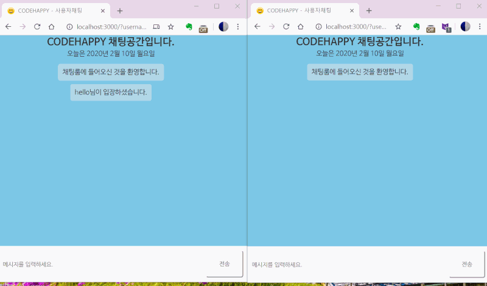

# Codehappy - Real-time Chat Application

> KH Programming bootcamp final project(Coded by Okchul Kim, Heesuk Yoon)

## Portfolio Introduction

It's real-time chat application using `SOCKET.IO`. Its CSS style is similar as Kakaotalk, most famous mobile chat-app in Korea.
When user join to channel, HTTP request must include Username, Userno, and room name.
If they are in one room together, then they can communicate together. If not, others cannot see other room's chat status. 
User can notify who's joining to room and who's disconnected.
When new message arrived, window automatically go to bottom. 

## Project stack

*Client-side*
* HTML5
* CSS3
* Javascript

*Server-side*
* Node.js
* Socket.io

*Main application is required to see profile picture.* If not, it also works but not completely work. [Main application](http://github.com/oggy-kim/team34-final-project)